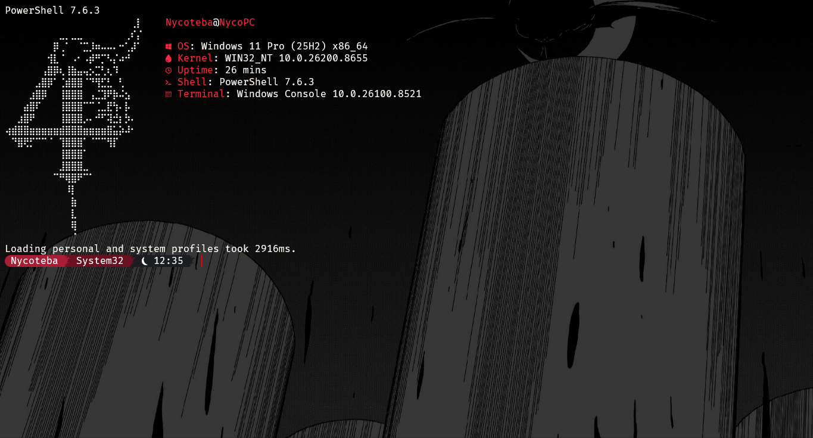
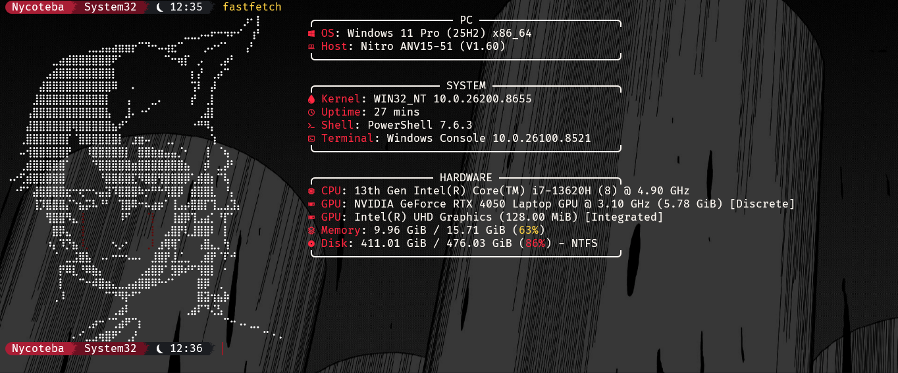

## Ghoul Theme

Um tema personalizado para terminal com vibe Tokyo Ghoul, inspirado no Ulquiorra de Bleach.

## Preview




## Componentes

- **Oh My Posh** - Prompt personalizado com chamas
- **FastFetch** - Info do sistema com ASCII art do Ulquiorra
- **Nerd Fonts** - JetBrainsMono Nerd Font
- **Windows Terminal** - Configurações personalizadas

## Instalação

### Pré-requisitos

- [PowerShell 7+](https://github.com/PowerShell/PowerShell)
- [Oh My Posh](https://ohmyposh.dev/)
- [FastFetch](https://github.com/fastfetch-cli/fastfetch)
- [JetBrainsMono Nerd Font](https://www.nerdfonts.com/)
- [Git](https://git-scm.com/)

### 1. Clonar o repositório

bash
git clone https://github.com/SEU-USUARIO/ghoul-theme.git
cd ghoul-theme


### 2. Instalar o tema Oh My Posh

Copie o arquivo `powershell/GhoulTheme.omp.json` para:

C:\Users\SEU-USUARIO\PowerShell\GhoulTheme.omp.json


### 3. Configurar o PowerShell Profile

Copie `powershell/Microsoft.PowerShell_profile.ps1` para:

C:\Users\SEU-USUARIO\Documents\PowerShell\Microsoft.PowerShell_profile.ps1

### 4. Configurar o FastFetch

Copie os arquivos da pasta `fastfetch/` para:

C:\Users\SEU-USUARIO.config\fastfetch\


### 5. Recarregar

```powershell
& $PROFILE

## Funcionalidades
Prompt com separadores em chamas 
Cores em tons de vermelho e grafite
ASCII art do Ulquiorra no FastFetch
Versão completa e minimalista do FastFetch
Ícones personalizados das Nerd Fonts

## Paleta de Cores

| Color | Hex | Usage |
| :--- | :---: | :--- |
| White | `#FFFFFF` | Text |
| Red | `#A91E35` | Primary highlight |
| Burgundy | `#6B1021` | Secondary background |
| Crimson | `#C71F37` | Git / Branches |
| Graphite | `#2C2F33` | Node.js |
| Dark Graphite | `#1B1D21` | Time |

## Licença

MIT License - Sinta-se livre para usar e modificar!

## Créditos

ASCII art do Ulquiorra baseado em arte da comunidade
Tema inspirado em Tokyo Ghoul e Bleach


### 5. Inicializar o Git

```powershell
git init
git add .
git commit -m "Initial commit: Ghoul Theme"
